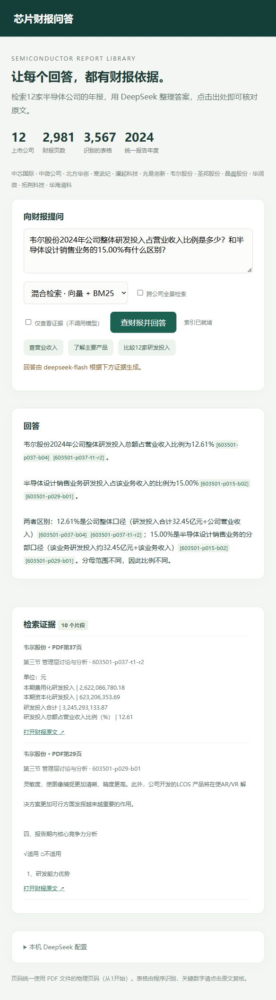

# 芯片财报问答：方向A

基于12家半导体上市公司的2024年年报全文，使用真实语义向量检索 + BM25 + RRF排序融合，调用本机配置的DeepSeek API回答，并返回公司、章节、PDF物理页码、原文片段与链接。

## 本次真实结果

2026-10-04使用 `deepseek-flash` 实测10题：**7题完全正确、2题不完整、1题部分正确**。不完整的两题都是跨12家公司的全景题；部分正确的一题虽然拒绝编造2026收入，却猜错了所引表格的含义。

- [一页结论PDF](docs/conclusion.pdf)
- [10题逐题记录](evaluation/10题实测记录.md)
- [完整模型输出与实际召回块](evaluation/raw_results.json)
- [判定依据](evaluation/review.json)
- [原文与表格抽查](evaluation/extraction_audit.md)

判定由AI助手逐题对照原文完成，不声称学生已人工复核。原始失败运行也被保留：API初次余额不足，以及默认思考模式导致两题无最终输出。最终记录采用统一设置重跑，保留失败原因，未挑选多次回答中的最佳答案。

## 每一步在做什么

1. **下载原文**：用同一年度、同一行业的材料，保证比较有基本可比性。来源为巨潮资讯，下载地址及SHA256记录在 `data/sources.json`。
2. **整理文字和表格**：按页提取全文。带线表格保存行列，切成小组时重复表头并保留附近的单位，避免数字失去含义。每块保留公司、章节和PDF页码。
3. **建立两个索引**：BM25擅长找相同关键词；多语言MiniLM把语义变成384维向量，擅长找相近表达。混合模式使用RRF融合两个排序，不直接相加不同量纲的分数。
4. **回答并给证据**：先检索，再把原文交给DeepSeek。提示词要求事实附块ID，不知道就说明不知道。页面提供PDF对应页链接。
5. **用10道题测试**：先从原文确定参考答案，再记录实际召回、模型回答、是否正确及错误原因。跨公司题对每家公司独立检索，减少遗漏。
6. **整理结论**：结论只依据实测结果，区分“找没找到证据”和“模型答没答对”。

## 材料

中芯国际、中微公司、北方华创、寒武纪、澜起科技、兆易创新、韦尔股份、圣邦股份、晶晨股份、华润微、拓荆科技、华海清科。

全部为2024年年度报告全文，共2,981页。PDF页码从1开始，与阅读器跳转位置一致。原始公司名称沿用2024年报告。下载原文即可复核，不依赖新闻或二手财务数据库。

## 运行

建议Python 3.12，首次建立向量索引在普通CPU上需要等待。

```sh
python -m venv .venv
# Windows: .venv\Scripts\activate
# macOS/Linux: source .venv/bin/activate
pip install -r requirements.txt
python download.py
python extract.py
python retrieval.py
python app.py
```

打开 http://127.0.0.1:8765 ，在页面底部配置DeepSeek密钥。服务仅监听本机。模型名可以留空，程序通过官方 `/models` 接口选择可用模型；密钥不写入浏览器存储、不出现在返回结果中、不写日志。

已完成配置后，可执行 `python evaluate.py` 重跑10题（会产生模型API用量）；`python evaluate.py --retrieval-only` 只检查检索，不产生模型回答。`python verify.py` 验证来源哈希、索引与块数量一致、单位标签等；`python build_conclusion.py` 按已核对记录生成一页PDF。重跑会覆盖 raw_results.json，但不会自动重写人工式判定的 review.json，修改参数或模型后应重新核对答案并更新判定。

嵌入模型：`sentence-transformers/paraphrase-multilingual-MiniLM-L12-v2`（FastEmbed ONNX）。首次使用会下载模型；网络无法访问Hugging Face时，可由使用者配置 `HF_ENDPOINT=https://hf-mirror.com`。模型下载后可离线检索；生成回答仍需DeepSeek API和账户额度。

## 参数与实现

- 文本块约320字符，重叠50字符；表格按3行一组并保留表头。表格块可能更长。
- BM25：jieba分词，k1=1.5、b=0.75。
- 向量：384维、L2归一化，余弦相似度；NumPy精确扫描。
- 混合检索：每路前80个结果，RRF常数60；单公司取10块，每页最多2块。
- 全景检索：每家公司取3块，12家公司最多36块。识别显式公司名或通过复选框开启。
- 模型只能看到召回证据，不会读入完整年报或参考答案。
- 最终实测：thinking=disabled、temperature=0、max_tokens=4000，记录finish_reason与token用量；空内容不视为生成成功。参数参照[DeepSeek官方思考模式说明](https://api-docs.deepseek.com/guides/thinking_mode/)。
- 所有数字的单位以证据为准；跨公司比较仍需统一口径。

## 已知边界

- 表格识别不保证100%正确；无线表格和跨页表格仍可能错列或失去表头。保存完整页文本作为补充，不声称所有表格都完整还原。
- MiniLM对输入有token上限；较长表格可能被截断后嵌入，BM25仍处理全文。大段落和复杂表格可进一步采用更长上下文的中文嵌入模型与重排器。
- 同行业内部包括设计、制造和设备公司，研发投入比例并不等价于研发效率。
- 提示词不能保证模型绝不编造；必须核对原文、单位、年份和引用支持关系。
- 当前程序无实时股价、无2025/2026经营实绩，不应拿2024年报回答之后的实际业绩。
- 自动评测的命中检查只是辅助；最终正确性需要阅读实际输出和引用证据。

## 密钥与提交

`.env`、财报PDF、模型和索引均被 `.gitignore` 排除。仓库上传源代码、来源清单、评测记录、一页结论和页面截图；不要上传本机环境或密钥。真实评测结果以 `evaluation/` 中的记录为准。

## 页面截图

截图为2026-10-05实际调用结果；10题评测记录仍为2026-10-04的统一测试。


